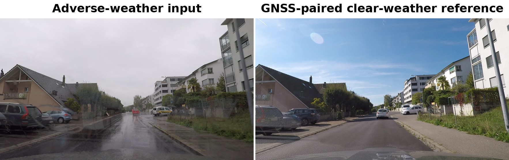
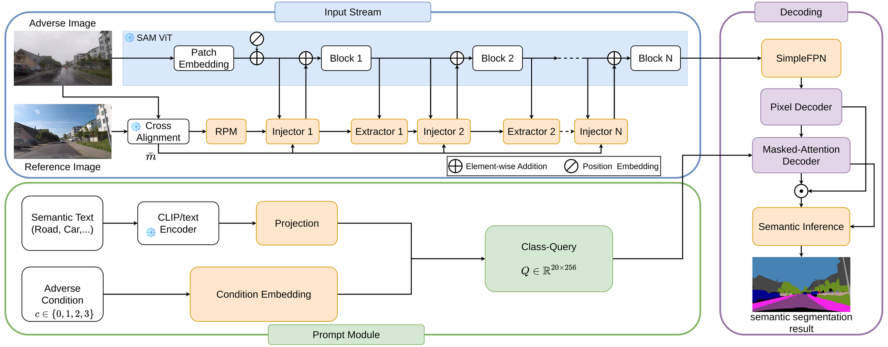
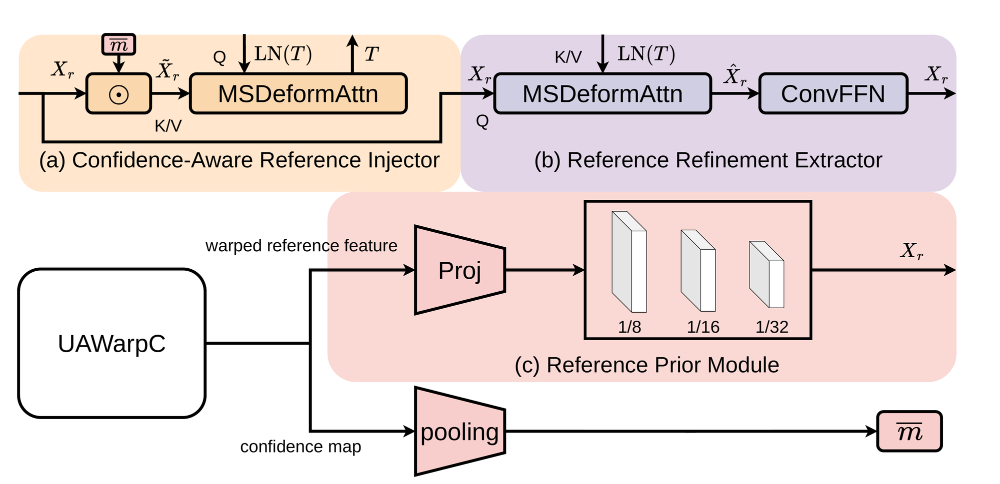
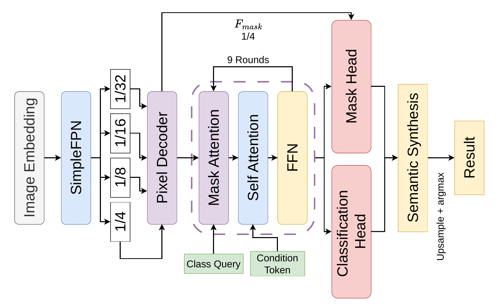
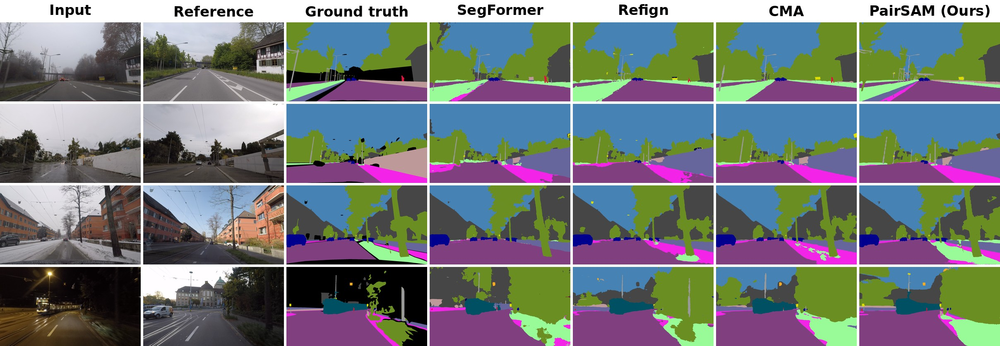
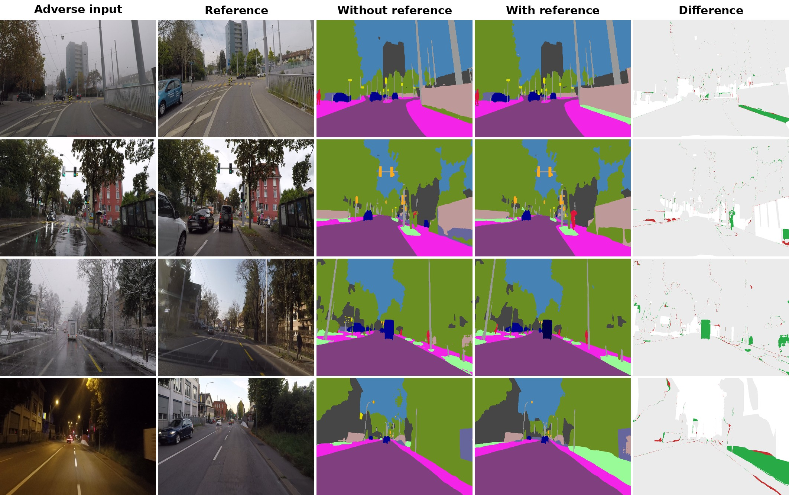
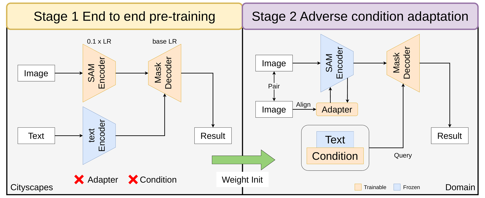

# PairSAM: Reference-Guided Adaptation of SAM for Adverse-Weather Semantic Segmentation

<div align="center">

**Parameter-efficient adaptation of SAM for adverse-weather semantic segmentation, guided by aligned clear-weather references**

[](#)
[](https://www.python.org/)
[](https://pytorch.org/)
[](segment-anything/LICENSE)

English | [繁體中文](README.zh-TW.md)

</div>

<p align="center"></p>
<p align="center"><em>PairSAM segments an adverse-weather frame with the help of a GNSS-paired clear-weather reference of the same scene.</em></p>

---

## Abstract

Semantic segmentation degrades sharply under adverse weather—fog, rain, snow, and night—where reduced contrast and texture corruption weaken the appearance cues that clear-weather models rely on. We present **PairSAM**, a parameter-efficient framework that adapts the frozen Segment Anything Model (SAM) ViT-H backbone to adverse conditions by injecting a *geometrically aligned clear-weather reference frame* as a structural prior. A GNSS-paired clear-weather image is aligned to the adverse-weather viewpoint by a frozen optical-flow alignment network, and its multi-scale VGG features—gated by an alignment-confidence mask—are injected into the ViT-H encoder through a multi-scale cross-attention adapter. Decoding follows a Mask2Former-style **unified query** formulation: nineteen class-specific query tokens interact through cross-class self-attention in a single TwoWayTransformer pass, and a lightweight residual depthwise-convolution head performs cross-class competition and spatial refinement on the assembled class-logit map. Training optimizes only about **2.98% (24.53M)** of the model's parameters while the ViT-H image encoder, CLIP text encoder, and the alignment network remain frozen. We evaluate on ACDC, Dark Zurich, and RobotCar Correspondence under the standard GNSS-paired protocol.

---

## Method Overview

<p align="center"></p>
<p align="center"><em><b>Architecture overview.</b> A frozen SAM ViT encoder receives confidence-gated reference features through injector/extractor stages; class queries built from CLIP text embeddings and a condition embedding are decoded into the 19-class semantic map.</em></p>

PairSAM maps an adverse-weather image and a GNSS-paired clear-weather reference to a 19-class semantic map through the following stages.

1. **Reference alignment (frozen).** `CMAAlignment` (VGG-16 + UAWarpC) estimates optical flow from the clear reference to the adverse-weather view, warps the reference features, and produces an alignment-confidence map. The module is loaded from pre-trained weights and kept frozen.
2. **Reference injection.** `MultiScaleCrossAttnInjector` (the *WarpedVGG Adapter*) injects the confidence-gated reference features into the ViT-H encoder via multi-scale cross-attention. Injection is applied **pre** the block self-attention at blocks 7/15/23/31, with learnable per-stage gates.
3. **Prompt encoding.** Class-name text embeddings (frozen CLIP ViT-B/32 + trainable projection) and a learnable **condition embedding** (fog/rain/snow/night) form the sparse prompts; ACDC uses the condition encoder in place of a geolocation prior.
4. **Unified mask decoding.** A `MaskDecoder` places all active class queries in a single TwoWayTransformer sequence (cross-class self-attention); each class has a dedicated hypernetwork MLP that produces its dynamic mask head. One mask per class—no IoU candidate selection.
5. **Logit refinement (LRH).** `ResidualDWConvFusion` performs cross-class competition (1×1 mixer, residual) followed by depthwise spatial smoothing on the assembled `(1, 19, H, W)` logit map.
6. **Loss.** Weighted cross-entropy with **median-frequency balancing (MFB)** + **Lovász-Softmax** + **Dice**.

<p align="center"></p>
<p align="center"><em><b>WarpedVGG Adapter.</b> Multi-scale cross-attention injection of the aligned, confidence-gated reference into the frozen ViT-H encoder.</em></p>

<p align="center"></p>
<p align="center"><em><b>Unified query decoding.</b> All class queries share one TwoWayTransformer pass; per-class hypernetwork MLPs produce dynamic mask heads.</em></p>

### Trainable / Frozen Modules

| Module | Status | Params |
|---|---|---|
| SAM ViT-H image encoder | Frozen | 637.03 M |
| CLIP text encoder (backbone) | Frozen | 151.28 M |
| CMAAlignment (VGG-16 + UAWarpC) | Frozen | 10.78 M |
| `MultiScaleCrossAttnInjector` (WarpedVGG Adapter) | **Trainable** | 17.32 M |
| `TwoWayTransformer` | **Trainable** | 3.29 M |
| `class_hypernetworks_mlps` | **Trainable** | 2.66 M |
| `pe_layer` | **Trainable** | 1.05 M |
| Text projection | **Trainable** | 0.13 M |
| `output_upscaling` | **Trainable** | 0.07 M |
| `class_mask_tokens` | **Trainable** | 4.9 K |
| `ResidualDWConvFusion` (LRH) | **Trainable** | 2.9 K |
| `ConditionEncoder` | **Trainable** | 1.0 K |
| **Total trainable** | | **24.53 M (2.98%)** |

---

## Results

All numbers follow the GNSS-paired evaluation protocol of Refign and CMA: mIoU over the 19 Cityscapes classes, computed at the native ground-truth resolution (1080×1920) with the confusion matrix aggregated globally over each split.

> Quantitative results are released upon completion of the multi-seed training protocol. Numbers below are placeholders.

### ACDC — overall and per-condition mIoU (validation, 406 images)

| Method | Backbone | Ref. | Fog | Rain | Snow | Night | mIoU |
|---|---|:--:|:--:|:--:|:--:|:--:|:--:|
| CMA | SegFormer | ✓ | — | — | — | — | — |
| Refign-DAFormer | MiT-B5 | ✓ | — | — | — | — | — |
| **PairSAM (ours)** | ViT-H (frozen) | ✓ | TBD | TBD | TBD | TBD | **TBD** |

### Cross-dataset generalization (mIoU)

| Method | Dark Zurich (test) | RobotCar Corr. (test) |
|---|:--:|:--:|
| CMA | 53.6 | 54.3 |
| Refign-DAFormer | 56.2 | 60.5 |
| **PairSAM (ours)** | **TBD** | **TBD** |

> ACDC **test-set** per-class IoU vs. prior Cityscapes→ACDC methods (CMA Table-1 format) is reported in the paper; predictions are exported with `scripts/eval/dump_acdc_test_preds.py` for server submission.

### Qualitative Results

<p align="center"></p>
<p align="center"><em><b>Qualitative comparison on ACDC (val).</b> One example per condition — fog, rain, snow, night — against SegFormer, Refign, and CMA.</em></p>

<p align="center"></p>
<p align="center"><em><b>What the reference changes.</b> Full model vs. the reference-free variant; in the difference map, green marks pixels the reference corrects, red those it breaks, gray where both agree.</em></p>

---

## Installation

### Prerequisites

- Python ≥ 3.10
- NVIDIA GPU with ≥ 24 GB VRAM (validated on RTX 4090)
- PyTorch 2.x (CUDA build)

### Setup

```bash
git clone https://github.com/Wally0924/Pair-SAM.git
cd Pair-SAM

conda create -n sam_env python=3.10 -y
conda activate sam_env

pip install torch==2.9.1 torchvision==0.24.1 --index-url https://download.pytorch.org/whl/cu128
cd segment-anything
pip install -r requirements.txt
pip install git+https://github.com/openai/CLIP.git
pip install -e .
```

Validated on Python 3.10 / Ubuntu 24.04 / CUDA 12.8 / RTX 4090 (24 GB); with this environment, `python -m pytest tests/ -q` passes all unit tests. Adjust the PyTorch index URL to match your CUDA toolkit if it differs.

### Pre-trained Checkpoints

Model weights are **not stored in this repository**. Download them and place under `segment-anything/checkpoints/`:

| File | Size | Required for | Source |
|---|---|---|---|
| `sam_vit_h_4b8939.pth` | ~2.4 GB | all ViT-H runs | [Segment Anything (Kirillov et al., ICCV 2023)](https://github.com/facebookresearch/segment-anything) |
| `sam_vit_b_01ec64.pth` | ~358 MB | ViT-B ablations | [Segment Anything](https://github.com/facebookresearch/segment-anything) |
| `cma_alignment_weights.pth` | ~69 MB | CMA alignment (VGG-16 + UAWarpC) | *[release link TBD]* |
| `cma_segformer_acdc.ckpt` | ~1.4 GB | CMA baseline comparison | *[release link TBD]* |
| `location_encoder_weights.pth` | ~37 MB | GNSS location encoding | *[release link TBD]* |
| `cityscapes_pretrain/sam_vit_h_cityscapes_merged.pth` | ~2.4 GB | clear-weather pre-training stage | *[release link TBD]* |

### Trained Models and Experiment Outputs

Training runs write to `segment-anything/outputs_*/`, which is excluded from version control (checkpoints alone exceed 100 GB). Trained PairSAM weights and the corresponding experiment records — `train_log.csv`, `e1_results.json`, `ablation_config.json`, and training curves for every ablation variant — are released separately: *[release link TBD]*.

---

## Datasets

PairSAM is evaluated under the **GNSS-paired** protocol shared with Refign and CMA: every adverse-weather target image carries a clear-weather reference retrieved by GNSS, used as the structural prior. All datasets use the 19 Cityscapes training-label classes.

| Dataset | Train | Val | Test | Primary variation |
|---|---:|---:|---:|---|
| **ACDC** | 1,600 | 406 | 2,000 | fog / rain / snow / night |
| **Dark Zurich** | 2,416 | 50 | 151 | nighttime |
| **RobotCar Correspondence** | 6,511 | 27 | 27 | cross-season / cross-time |

Datasets are **not redistributed here** — obtain them from the official sources (ACDC, Dark Zurich, MUSES, Cityscapes) under their respective licenses and arrange them under a common root following the directory tree in [`Datasets/README.md`](Datasets/README.md). The layout is close to the official one but not identical: ACDC and Dark Zurich archives are extracted into folders named after the archive, and Cityscapes uses `Images/` and `GT/` sub-folders. That file also lists every manifest CSV, its columns, and a one-command check that your layout resolves.

Manifest CSV columns (`acdc_adverse_ref_rgb_{train,val}.csv`):

```text
image_path, ref_image_path, gt_path, condition, condition_id, invalid_mask
```
where `condition_id ∈ {0: fog, 1: rain, 2: snow, 3: night}`.

### Path Configuration

The manifest CSVs ship with placeholders instead of absolute paths, so set the dataset root before running anything:

```bash
export DATASET_ROOT=/path/to/your/Datasets   # defaults to ~/Datasets
```

`${DATASET_ROOT}` (external datasets) and `${REPO_ROOT}` (in-repo feature caches) are expanded automatically by [`Datasets/path_resolver.py`](Datasets/path_resolver.py) when `pair_dataloader.py`, `precompute_features.py`, or `train.py` read a manifest. No manual substitution is needed.

> **Note.** Several helper scripts under `segment-anything/scripts/` still carry the original author's absolute paths as argparse or shell defaults (e.g. `run_muses_cond8.sh`, `make_ch4_figs.py`). These are one-off analysis and figure-generation utilities — override the relevant `--csv` / `--output_dir` arguments, or edit the defaults, before running them. The training and evaluation entry points documented in this README take explicit paths and need no such edits.

<!-- -->

> **Note.** GT for the ACDC test set is held out by the official server; the per-condition and ablation analyses in this repository use the ACDC **validation** split (406 images), whose labels are public.

---

## Training

The complete model (**FULL**) corresponds to `train.py` defaults with reference injection on, pre-block injection, unified decoding, refinement head on, and the CE+Lovász+Dice+MFB objective.

<p align="center"></p>
<p align="center"><em><b>Training protocol.</b> Clear-weather pre-training on Cityscapes precedes adverse-weather adaptation on ACDC.</em></p>

```bash
cd segment-anything
python train.py \
  --model_type vit_h \
  --train_csv /path/to/acdc_adverse_ref_rgb_train.csv \
  --val_csv   /path/to/acdc_adverse_ref_rgb_val.csv \
  --inject pre --decoder unified --lrh --mfb \
  --lovasz_weight 1 --dice_weight 1 \
  --epochs 50 --patience 10 --batch_size 1 --accumulate_steps 4 --lr 5e-5 \
  --seed 42 --output_dir outputs/full_seed42
```

### Key Hyperparameters

| Argument | Default | Description |
|---|---|---|
| `--lr` | 5e-5 | Peak LR; 5-epoch linear warmup + cosine decay |
| `--epochs` | 30 | Upper bound; early stopping on val mIoU (`--patience 10`) |
| `--batch_size` / `--accumulate_steps` | 1 / 4 | Effective batch 4 (gradient accumulation, AMP) |
| `--lovasz_weight` / `--dice_weight` | 1.0 / 1.0 | Lovász-Softmax / Dice weights (set both 0 → pure CE) |
| `--adapter_lr_scale` | 3.0 | LR multiplier for the WarpedVGG Adapter |
| `--decoder_lr_scale` / `--transformer_lr_scale` | 0.5 / 0.05 | LR multipliers for decoder tokens / transformer |

### Ablation Switches

Each design dimension is a single flag, so any component can be toggled while holding the rest fixed:

| Flag | Effect |
|---|---|
| `--inject {pre,post}` | Reference injection before / after ViT block self-attention |
| `--decoder {unified,per_class}` | Joint vs. per-class independent decoding (identical parameter count) |
| `--lrh / --no-lrh` | Enable / disable the residual refinement head |
| `--mfb / --no-mfb` | Median-frequency-balanced vs. uniform class weighting |
| `--ref / --no-ref` | Inject reference content vs. zero it out (isolates reference signal from adapter capacity) |
| `--use_vgg_adapter / --no-use_vgg_adapter` | Enable / disable the adapter entirely |

> **Note on Rare-Class Sampling (RCS).** A DAFormer-style rare-class data sampler is implemented (`--rcs`, default off) and was evaluated against the loss-level MFB balancing. In our setting MFB alone was superior, so RCS is **not** part of the released FULL configuration; the code is retained for reproducibility, and the MFB-vs-RCS comparison is reported in the released experiment records.

---

## Evaluation

mIoU is computed over the 19 classes at the native ground-truth resolution (1080×1920), with the confusion matrix aggregated globally over the split (consistent with the ACDC server and the Refign/CMA protocol).

```bash
# Per-class × per-condition IoU + overall / per-condition mIoU (JSON + Markdown)
python scripts/eval/eval_e1_acdc_val_full.py \
  --ckpt outputs/full_seed42/weather_sam_best_latest.pth \
  --out  outputs/full_seed42/e1_results.json
```

---

## Project Structure

```
Pair-SAM/
├── segment-anything/
│   ├── segment_anything/modeling/
│   │   ├── pair_sam.py               # Top-level model; reference pre-align + adapter
│   │   ├── vgg_adapter.py            # MultiScaleCrossAttnInjector (WarpedVGG Adapter)
│   │   ├── fusion.py                 # CMAAlignment (VGG-16 + UAWarpC) + flow-guided fusion
│   │   ├── fusion_head.py            # ResidualDWConvFusion (LRH)
│   │   ├── pair_mask_decoder.py      # Mask2Former-style unified / per-class decoder
│   │   ├── pair_prompt_encoder.py    # Text + condition prompt encoder
│   │   ├── transformer.py            # TwoWayTransformer
│   │   └── semantic_assembly.py      # 19-class logit assembly + gated LRH
│   ├── utils/
│   │   ├── new_loss.py               # ContextLoss (CE+MFB+Lovász) + MaskLoss (Dice)
│   │   ├── rare_class_sampler.py     # DAFormer-style RCS (optional, off by default)
│   │   └── pair_dataloader.py        # ACDC dataset (adverse + reference + condition)
│   ├── scripts/
│   │   ├── eval/eval_e1_acdc_val_full.py   # per-class × per-condition mIoU
│   │   └── aggregate_ablation.py           # ablation tables → LaTeX
│   ├── train.py                      # training entry point
│   ├── pair_trainer.py               # training / validation loop
│   ├── run_ablation_batch1.sh        # ablation campaign (batch 1)
│   ├── run_ablation_batch2.sh        # ablation campaign (batch 2)
│   └── tests/                        # pytest unit tests for each switch
├── Datasets/
│   ├── path_resolver.py              # ${DATASET_ROOT} / ${REPO_ROOT} expansion
│   ├── *.csv                         # dataset manifests (portable placeholders)
│   └── class_presence.json           # per-image class table for RCS
└── README.md
```

Not tracked here: model weights (`checkpoints/`), training runs (`outputs_*/`), feature caches, benchmark submission packages, and the paper sources. See the release links above.

---

## Citation

```bibtex
@article{pairsam,
  title   = {PairSAM: Reference-Guided Adaptation of SAM for
             Adverse-Weather Semantic Segmentation},
  author  = {[Author Names]},
  journal = {[Venue]},
  year    = {2026},
  note    = {Paper link TBD}
}
```

---

## License

This repository inherits the **Apache License 2.0** from the Segment Anything codebase; see [segment-anything/LICENSE](segment-anything/LICENSE). Third-party components (CLIP, VGG, UAWarpC) retain their respective licenses.

## Acknowledgements

PairSAM builds on **Segment Anything** and **Mask2Former** (Meta AI Research), **CLIP** (OpenAI), and the **CMA / Refign** GNSS-paired evaluation protocol. We thank the authors of **ACDC**, **Dark Zurich**, and **RobotCar Correspondence** for releasing their benchmarks.

Funding and institutional acknowledgements: *[to be added upon publication.]*
